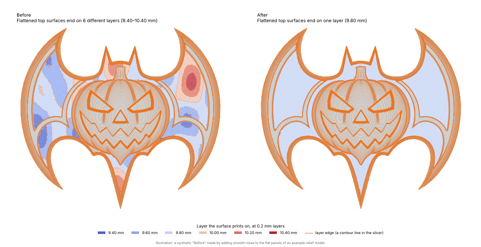

# stl-smoothing

Remove **strangely offset layer lines** from generated STL models.

Generated models (reliefs, lithophanes, SDF / marching-cubes output, AI meshes) often
contain surfaces that are *meant to be flat* but wobble by a fraction of a millimetre.
A slicer cuts such a surface at every layer it wanders through, so the printed top is
covered in contour lines at odd places. `stl-smoothing` finds those surfaces and moves
their vertices (in **z only**) onto **one** layer boundary, so each of them prints on a
single layer. Everything that is really shaped (a dome, a ramp, a wall, a raised block)
is left alone.



*Illustration: a synthetic "Before", made by adding smooth noise to the flat panels of an
example relief model. Left: the background panels end on 6 different layers and the
slicer draws layer edges (orange) all over them. Right: one layer, no lines. The rings on
the pumpkin are its dome shape and are supposed to be there.*

## Use it in your browser (no install)

The same tool runs as a web page: choose an STL, set your layer height, and download the
smoothed file, with a before/after picture you can zoom. **Your model never leaves your
computer**; the Python engine ([Pyodide](https://pyodide.org), Python compiled to WebAssembly)
runs inside the page. The first visit downloads the engine (about 25 MB), which the browser
then keeps.

Once GitHub Pages is switched on (below) it lives at
`https://<your-user>.github.io/STL-Smoothing/`, for example
<https://captainteach123.github.io/STL-Smoothing/>.

To switch it on: **Settings -> Pages -> Build and deployment -> Source: "Deploy from a
branch"**, pick the branch you want to publish (your default branch; `main` if you have one)
and the folder **`/docs`**, then Save. The first deploy takes a minute or two. GitHub Pages
needs a public repository on a free plan. The site is plain files in `docs/` (no build step on
GitHub), so it also works from any static host or from `python -m http.server --directory docs`
(open it at `http://localhost:8000/`; browsers will not run the engine from a `file://` page).
With "Deploy from a branch" every push to that branch goes live, so publish a branch whose CI
(see below) is green.

Limits of the web version: a browser tab has less memory than a terminal, so use the command
line for very large models. It writes binary STL, and it draws the before/after picture only
for models up to 1.5 million triangles. The page warns above 1 million triangles and refuses
files over 200 MB. What was measured (desktop Chromium on a GitHub Actions runner; your device's
memory decides what you get): 111,000 triangles took 2-3 s, 1.0 million 17 s, 1.46 million 25 s
and 2.76 million (138 MB) 35 s, each with the same result as the command line. A 3.97 million
triangle file (198 MB) ran out of memory, and the page said so and pointed to the command-line
version. Phones will manage less.

## Install

```bash
pip install .                 # numpy + scipy
pip install ".[report]"       # + matplotlib, for --report pictures
```

Python 3.9 or newer.

## Use

```bash
stl-smoothing model.stl                        # writes model_smoothed.stl
stl-smoothing model.stl -o fixed.stl -l 0.16   # 0.16 mm layers
stl-smoothing model.stl --analyze --report before_after.png   # look first, write nothing
python -m stl_smoothing model.stl              # same thing without installing the script
```

Example output (the model from the picture above):

```
batwing_before.stl: 199,652 triangles, 99,828 vertices, 152.6 x 137.9 x 18.6 mm
Flattened 1 surface (heights above the bed, 0.2 mm layers):
  top     6 patches      3,664 mm²  9.32–10.37 mm     6 layers  ->  9.80 mm
Layer edges on those surfaces: 654 mm -> 0 mm
Note: a flattened surface varied by more than 1 mm. If it is really meant to be curved or sloped, run again with a smaller --max-range (for example --max-range 1).
Levelled 1 nearly-flat surface that grazed a slicer sampling plane (they already printed on one layer, with a few stray layer edges):
  top     3 patches        867 mm²  7.95–8.13 mm      1 layer   ->  8.00 mm
Moved 17,428 vertices, largest move 0.64 mm, in z only; 0 flipped faces, 1 new degenerate faces.
Left alone: 9 candidates (use -v for details)
```

Exit codes: `0` success (including "nothing to do"), `1` the file could not be processed,
`2` bad command line. Errors are printed to stderr.

Always check the result in your slicer's layer preview (and `--report`) before you print.

### Options

| option | meaning |
| --- | --- |
| `-l, --layer-height MM` | your slicer's layer height (default 0.2). **Set this to match your slicer.** |
| `--first-layer MM` | first layer height if it differs from the others |
| `--max-range MM` | widest height variation of ONE flat surface (default 2.0). More than that is an intentional shape. **Lower it (e.g. `1.0`) to protect gently curved plates and shallow ramps; raise it if a very wobbly surface is left alone.** |
| `--max-slope DEG` | a surface is "flat" while within this many degrees of horizontal (default 5), measured on smoothed normals |
| `--min-area MM2` | ignore flat surfaces smaller than this (default 40) |
| `--no-snap-exact` | do not move already-flat surfaces that sit exactly on a slicer sampling plane (see step 3) |
| `--analyze` | report only, write no STL (a `--report` picture is still written) |
| `--report PNG` | before/after picture of the surfaces that changed (`.png`, `.jpg`, `.pdf`, `.svg`; needs matplotlib). A failure to write it never stops the STL being written |
| `--ascii` | write an ASCII STL (default: binary) |
| `--weld-tol MM` | merge corners closer than this (default: automatic, about 5e-7 x the largest coordinate; `0` = exact matches only) |
| `--set NAME=VALUE` | override any advanced parameter, see `src/stl_smoothing/params.py` |
| `-v` | also list what was found but left alone, and why |

Assumptions: **z is up, units are millimetres**, and heights are measured from the lowest
point of the model (where a slicer puts the bed).

## What it does, exactly

1. **Finds flat-ish surfaces.** A face counts as flat when its normal, *smoothed over a
   ~1 mm neighbourhood of nearly-flat faces*, is within 5° of vertical. Smoothing makes
   it immune to per-vertex facet jitter (marching-cubes / remeshed output) that tilts
   single triangles by many degrees on a surface that is really flat.
2. **Finds the levels.** An area-weighted histogram of the heights of all flat faces, over
   the whole model, has a peak at each intended level. Disconnected panels at the same
   level add up to the same peak, which is what puts the left wing, the right wing and
   the centre of a relief on the *same* layer. A deep valley between two peaks (a real
   step) keeps them apart.
3. **Keeps what is intentional.** Surfaces whose heights are spread evenly (ramps, crowns),
   whose edge continues smoothly into a slope, that vary by more than `--max-range`, or
   that already print on a single layer clear of the slicer's sampling planes are left
   alone. Faces that are already exactly flat are anchors: a noisy neighbour being
   flattened does not drag them. (The one exception: an exactly flat top or ceiling of at
   least 5 mm² that sits *on* a sampling plane, e.g. a 12.5 mm tall block at 0.2 mm layers,
   could print on either layer, so it is moved by half a layer to the nearest layer
   boundary and reported as "on a sampling plane". `--no-snap-exact` turns that off.)
   Where two patches of a plateau meet at a wall at least 1.5 layers high, that step is
   kept (an embossed pad stays embossed).
4. **Snaps to a layer boundary.** Slicers sample each layer at its mid-height, so a
   surface exactly *on* a boundary is half a layer from both neighbouring sample planes
   — the most robust place for a flat top. The plateau goes to the boundary nearest its
   median height.
5. **Moves vertices smoothly.** Only z changes. The move is feathered into neighbouring
   faces so no crease appears where a plateau meets a skirt, walls are kept from
   folding over, and any face that would still flip is damped back. Triangle count,
   order and winding are unchanged.

Running it again on its own output normally changes nothing.

## Limits — read these

* **Wobble versus shape cannot always be told apart.** A gently crowned plate or a shallow
  ramp whose total height variation is below `--max-range` and which is bounded by walls
  looks exactly like a wobbly flat panel. The defaults treat evenly-spread surfaces wider
  than 1 mm as shapes; anything gentler than that is flattened. If you have such features,
  lower `--max-range` and look at the `--report` picture.
* A deliberate step smaller than about 1.5 layers is ambiguous when the surfaces on both
  sides wobble by as much; the two levels are merged.
* Surfaces that vary by more than `--max-range` are left alone, and reliability falls off well
  before that limit. In about 1,000 random wobbly panels, a panel with less than 1.25 mm of
  variation was flattened completely in all but 1 of 642 cases; between 1.25 and 1.75 mm about
  1 in 14 ended up only partly flattened, and between 1.75 and 1.9 mm about 2 in 5 did (stray
  layer edges are left). Surfaces that wobble by about 1.2 mm or less, like the one in the picture above, are in the safe range.
* Only horizontal surfaces (tops and ceilings) are handled. Wobbly *vertical* walls and
  generally curved surfaces are not touched. Mesh noise on slanted surfaces is out of scope.
* NaN or infinite coordinates are rejected (exit code 1). Meshes with open edges are processed
  (with a warning) but may be flattened incompletely.
* Plates thinner than about two layers are quantised to the layer grid, so they can come out up
  to a layer thicker or thinner (a slicer rounds them the same way).
* Models whose flat surfaces are tilted by a few degrees on purpose need `--max-slope`
  raised, or are simply left alone.

## Python API

```python
from stl_smoothing import stlio
from stl_smoothing.mesh import Mesh
from stl_smoothing.layers import LayerGrid
from stl_smoothing.flatten import flatten

data = stlio.read_stl("model.stl")
mesh = Mesh.from_triangles(data.tris, tol=5e-5)
result = flatten(mesh, LayerGrid(0.2), max_range=1.5)
for p in result.plateaus:
    print(p.facing, p.area, p.layers_before, "->", p.level_after)
stlio.write_stl("fixed.stl", Mesh(result.verts, mesh.faces).to_triangles())
```

## Development

```bash
pip install -e ".[dev]"
pytest                                       # about 280 tests (a couple of minutes with the browser ones)
STL_SMOOTHING_SAMPLE=path/to/model.stl pytest tests/test_flatten.py   # + real-model test
python tests/bench.py algo.py [--holdout] --sample path/to/model.stl  # score an algorithm
```

`tests/scenes.py` builds closed test models with known ground truth (wobbly slabs,
panels around domes, ceilings, ramps between plateaus, intentional blocks, ...);
`tests/metrics.py` emulates the slicer to measure the layer edges left on a surface.
The web page is `docs/` (`index.html`, `app.js`, `worker.js`, `style.css`). It runs the Python
package from `docs/py/`, a copy of the modules it needs, so after changing anything in `src/`
run `python scripts/build_site.py` (a test fails if the copy is stale). Browser tests:
`pip install ".[webtest]"` then `pytest tests/test_web_ui.py` (headless Chromium against a stub
engine). `.github/workflows/site.yml` also runs the real engine end to end on GitHub.

`tests/bench.py` takes any file defining `smooth(mesh, grid) -> (V, 3) array` and scores it
on those scenes (and on a re-noised copy of a real model, if given with `--sample`).
